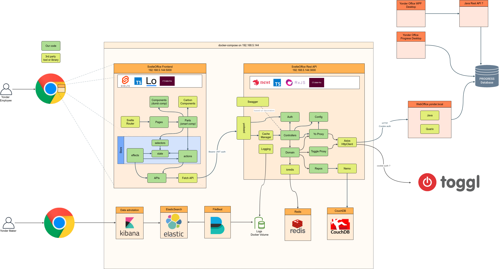

# Welcome to WebOffice Svelte UI

## Architecture - The big picture

### Frontend

- Svelte
- TypeScript
- Prettier
- Rollup
- date-fns
- Fetch API
- [Carbon Components Svelte](https://carbon-components-svelte.onrender.com/)
- Hero Icons

### Backend (private repo)

- It's basically doing reverse engineered requests to WebOffice
- NestJS
- Rest API using JWT authentication
- Swagger,
- CouchDB
- Redis
- Winston with daily log rotation
- Http CacheManager

### Development and CI

- Git
- VSCode + DevContainers
- Github + GithubActions
- Docker + Github Container Registry

## Infrastructure as Code (private repo)

- docker-compose
- Nginx
- Elasticsearch + Kibana + Filebeat
